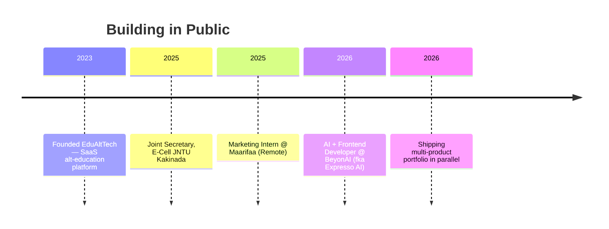

<div align="center">


<a href="https://github.com/ukk1019-yhat">
  
</a>

<br/>

<a href="https://ukkprotfolio.vercel.app"></a>
<a href="https://www.linkedin.com/in/chokkapu-uma-krishna-kanth-50a502288/"></a>
<a href="mailto:umakrishnakanthchokkapu15@gmail.com"></a>
<a href="https://github.com/ukk1019-yhat"></a>


</div>


## 🖥️ `whoami`


```yaml
uma_krishna_kanth:
  role: "Founder & CEO, EduAltTech"
  also: "AI Developer @ BeyonAI (fka Expresso AI)"
  studying: "B.Tech CSE @ JNTU Kakinada · 2027"
  based_in: "Kakinada, Andhra Pradesh, India 🇮🇳"

  stack:
    languages: [Python, Java, SQL, JavaScript]
    frontend: [React, Vite, HTML5, CSS3, Three.js]
    tools: [Figma, Notion, Canva, Vercel]
    exploring: [LLM Agents, SaaS Architecture, DevOps]

  fun_fact: "2× National Gold Medalist 🥇 in Softball"
  motto: "Build fast. Automate everything. Stay elite. 🚀"

  status: currently_shipping
```

<br clear="right"/>


## 🛠️ Tech Arsenal

<div align="center">


<br/><br/>


</div>

<br/>

## 🐍 Contribution Snake

<div align="center">

<!--START_SECTION:snake-->

<!--END_SECTION:snake-->

<sub>⚡ Auto-generated nightly from live contribution graph — see setup note below</sub>

</div>


## 📊 The Numbers

<div align="center">


</div>


## 💼 Career Timeline



<details open>
<summary><b>🚀 Expresso AI / BeyonAI — AI & Frontend Developer</b> <sub>(2026 – Present)</sub></summary>
<br/>

`Python` `JavaScript` `React` `AI Automation` `SaaS Architecture`

- Building a B2B behavioral-intelligence platform using adaptive AI simulations for communication & leadership training
- Defining scalable MVP architecture for enterprise-grade deployment
- Designing intelligent automation pipelines for repetitive business processes

</details>

<details>
<summary><b>🎓 EduAltTech — Founder & CEO</b> <sub>(2023 – Present) · Kakinada, India</sub></summary>
<br/>

`HTML` `CSS` `JavaScript` `Figma` `Product Strategy`

- Founded a SaaS-based alternative learning platform tackling flexibility & skill-alignment gaps in traditional education
- Architected and shipped the MVP end-to-end — strategy through frontend delivery
- Driving growth through automation-led, adaptive learning experiences

</details>

<details>
<summary><b>🏛️ E-Cell, JNTU Kakinada — Joint Secretary</b> <sub>(2025)</sub></summary>
<br/>

`Leadership` `Mentorship` `Startup Execution`

- Mentored student teams on idea validation and early-stage execution
- Organized workshops fostering entrepreneurial culture on campus

</details>

<details>
<summary><b>📣 Maarifaa — Marketing Intern</b> <sub>(Oct 2025 · Remote)</sub></summary>
<br/>

`Content Strategy` `EdTech` `International Marketing`

- Supported an Africa-based ed-tech startup with content strategy for global student pathways

</details>


## 🚀 Featured Builds

<div align="center">

| | Project | Stack | What it does |
|---|---|---|---|
| 🎓 | **[GenesisLMS](https://github.com/ukk1019-yhat/GenesisLMS)** | React · Node · Role-based Auth | Full learning management system — Admin / Teacher / Accountant roles, adaptive curriculum flows |
| 🐼 | **[Mamasparsh](https://github.com/ukk1019-yhat/Mamasparsh)** | React 19 · Supabase · Clerk · Bun | Panda-themed preschool platform with play-based UX for early learners |
| 🧠 | **[BeyonAI](https://github.com/ukk1019-yhat/BeyonAI)** | TypeScript | Behavioral-intelligence platform — adaptive AI simulations for real-world conversation training |
| 🎒 | **[Edu-Alt-Tech](https://github.com/ukk1019-yhat/Edu-Alt-Tech-website)** | TypeScript | Adaptive learning platform for flexible, skill-aligned education |
| 🥦 | **FreshGuard AI** | React · Vite · JS | Mobile-first grocery expiry tracker — auto-classifies Fresh / Expiring / Expired in real-time |
| 📄 | **OCR Intelligent Correction** | React · Vite | AI-powered OCR anomaly detection with modular, HMR-optimized architecture |

</div>


## 🏅 Wins & Certifications

<div align="center">


| 🏆 | Achievement | Details |
|:---:|---|---|
| 🥇 | **Gold Medalist — 44th Senior National Softball Championship** | National level · 2022–2023 |
| 🥇 | **Gold Medalist — 39th Junior National Softball Championship** | National level · 2021–2022 |
| 🎯 | **Finalist — Subu Kota Foundation Startup Event** | Competitive pitch · national recognition |
| 🤖 | **Advanced Generative AI** | Certified — Databricks |
| 🧠 | **ChatGPT API Fundamentals** | Certified — Simplilearn |

</div>

## 🎓 Education

| Degree | Institution | Year | Score |
|---|---|:---:|:---:|
| B.Tech — Computer Science & Engineering | JNTU Kakinada | 2024 – Present | In Progress |
| Intermediate (MPC) | Narayana Junior College, Vellanki | 2021 – 2023 | 910 / 1000 |
| SSC (Class X) | Sri Chaitanya School, Bobbili | 2020 – 2021 | GPA 10 / 10 |


## 🧠 Currently Leveling Up

<div align="center">

```text
🤖 AI Automation      ██████████████░░░░░░  70%   LLM integrations, agentic workflows
🏗️ SaaS Architecture  ███████████░░░░░░░░░  55%   Multi-tenant backends, Redis, Postgres
🎨 Frontend Craft     ████████████████░░░░  80%   Three.js, motion design, design systems
📦 DevOps Basics      ████████░░░░░░░░░░░░  40%   CI/CD, Docker, Vercel pipelines
🧪 Product Strategy   █████████████░░░░░░░  65%   B2B GTM, pricing, growth loops
```

</div>

## 💬 Random Dev Wisdom

<div align="center">

</div>


<div align="center">

### 🌐 Let's Build Something

[](https://ukkprotfolio.vercel.app)
[](https://www.linkedin.com/in/chokkapu-uma-krishna-kanth-50a502288/)
[](mailto:umakrishnakanthchokkapu15@gmail.com)

<br/>


</div>
